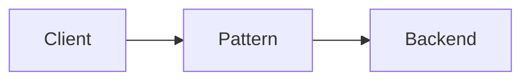

## What it is

Describe the pattern in beginner-friendly language.

## Why teams use it

Explain the problem it solves.

## When to use it

Give a rule of thumb and link related patterns or case studies.

