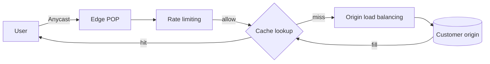

## Problem & Requirements

Cloudflare sits in front of customer origins to make sites faster and safer. It must terminate TLS near users, cache what it can, block or throttle abuse, and fail closed enough to protect origins without breaking legitimate traffic. Beginners should see the edge as a programmable reverse-proxy fleet: every request is an opportunity to serve from cache, apply a rate limit, or route to a healthy origin.

Video platforms like [Netflix](/case-studies/netflix-video-streaming) and [YouTube](/case-studies/youtube-video-delivery) depend on similar CDN and cache physics, even when they run their own footprints.

## High-Level Design

Anycast DNS and routing pull clients into a nearby POP. Inside the POP, proxies enforce security features, consult caches, and forward misses to origins (or to other tiers) through load-balanced paths. Rate limiting and related controls run early so expensive work never reaches the customer’s servers.

Patterns: [CDN](/patterns/cdn), [rate limiting](/patterns/rate-limiting), [caching](/patterns/caching), [load balancing](/patterns/load-balancing).

## Key Components

- **Anycast-fronted POPs** — many cities announcing the same IPs so users land nearby.
- **Edge proxies** — HTTP pipeline for cache, WAF, bot management, and workers.
- **Cache tier** — object and, where applicable, tiered cache hierarchies.
- **Rate limiting / DoS controls** — per-IP, per-token, and rule-based budgets.
- **Origin connectivity** — smart routing and health-aware load balancing to customer infrastructure.

## Deep Dives

### CDN

Serving static assets and cacheable API responses from POPs cuts latency and origin bandwidth. Tiered caching further reduces duplicate fills across nearby cities. Purge and cache-key design are product features as much as infrastructure details. Pattern: [CDN](/patterns/cdn).

### Rate Limiting

Edge rate limits stop credential stuffing, scrapers, and volumetric abuse before they become an origin outage. Thresholds must balance protection with false positives during legitimate spikes—product launches look a lot like attacks in raw request charts. Pattern: [rate limiting](/patterns/rate-limiting); Uber uses similar admission ideas closer to the app in [ride matching](/case-studies/uber-ride-matching).

## Trade-offs

- **Aggressive blocking vs. availability** — safer for origins, riskier for edge-case clients and shared NATs.
- **Long cache TTLs vs. freshness** — performance wins versus purge urgency for news or inventory.
- **More POP capacity vs. consistency of features** — global rollouts must stay uniform enough for customers to reason about.
- **Complex edge logic vs. debuggability** — Workers and custom rules are powerful but harder to trace end-to-end.

## Evolution

Cloudflare began as a reverse-proxy CDN/security service and expanded into a full edge platform (DNS, serverless compute, zero-trust networking). The architectural constant is push decisions and bytes as close to the user as possible while keeping origins small and boring.

## Sources

- [The Cloudflare Blog — CDN and caching](https://blog.cloudflare.com/) (cache, tiered cache, and performance posts)
- [The Cloudflare Blog — rate limiting and DoS](https://blog.cloudflare.com/) (abuse mitigation and rate limit product engineering)
- [The Cloudflare Blog — how Anycast and the network work](https://blog.cloudflare.com/) (POP and routing deep dives)
