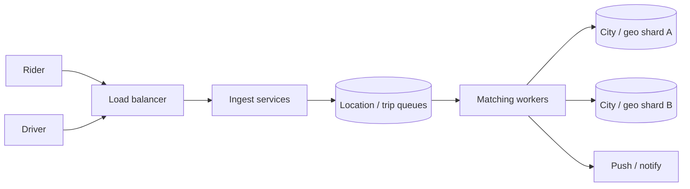

## Problem & Requirements

Uber must match riders and drivers in seconds while both sides move, demand spikes around events, and each city has different density and rules. The system ingests high-frequency location updates, runs matching and pricing logic, and notifies both parties—without letting one busy downtown melt a global monolith. Beginner takeaway: partition by geography, buffer bursts with queues, and protect APIs when clients retry aggressively.

Edge admission-control ideas also appear in [Cloudflare’s rate limiting story](/case-studies/cloudflare-edge).

## High-Level Design

Mobile clients stream locations and trip requests into regional entry points. Load balancers spread traffic across ingest services. Location and match work is sharded by city or geospatial cell. Queues decouple noisy producers from matching workers so a surge of pings does not equal a surge of synchronous DB writes. Rate limits shed abusive or buggy client storms before they deepen.

Patterns: [queues](/patterns/queues), [sharding](/patterns/sharding), [load balancing](/patterns/load-balancing), [rate limiting](/patterns/rate-limiting).

## Key Components

- **Ingest & gateway layer** — authenticated APIs with load balancing and rate limits.
- **Location pipeline** — high-volume updates buffered through queues.
- **Matching / dispatch workers** — consume queues and compute pairings per shard.
- **Geo / city shards** — keep state and indexes local to a region of the map.
- **Pricing & ETA services** — adjacent real-time systems with similar scale pressures.

## Deep Dives

### Queues

Queues absorb the mismatch between “phones can ping often” and “matchers need stable batches of work.” They enable retries, backpressure, and independent scaling of producers vs. consumers. Without them, every location update becomes a synchronous thundering herd. Pattern: [queues](/patterns/queues).

### Sharding

Uber’s map is too big for one matching brain. Sharding by city or geohash-like cells keeps indexes small and failure domains local—a bad deploy in one region should not pause another continent. Hot cells (stadiums, airports) still need careful capacity planning. Pattern: [sharding](/patterns/sharding).

## Trade-offs

- **Match quality vs. latency** — waiting for a better driver improves efficiency but hurts perceived speed.
- **Finer shards vs. boundary rides** — small cells scale well but complicate trips that cross shard edges.
- **Heavy rate limits vs. false positives** — protect the core, but do not block legitimate surge traffic.
- **Queue depth vs. freshness** — deep buffers smooth load but stale locations degrade matches.

## Evolution

Dispatch started simpler and more centralized; growth forced regionalization, ring/cell partitioning, and event-driven pipelines (often on Kafka-like logs). The lasting pattern for students: real-time marketplaces are queue + shard problems first, and “clever matching math” second.

## Sources

- [Uber Engineering Blog — real-time market and dispatch](https://www.uber.com/blog/engineering/) (matching, marketplace, and location system posts)
- [Uber Engineering Blog — Kafka and async pipelines](https://www.uber.com/blog/engineering/) (ingestion and stream processing write-ups)
- [Uber Engineering Blog — ringpop / geo scaling](https://www.uber.com/blog/engineering/) (partitioning and service discovery articles)
