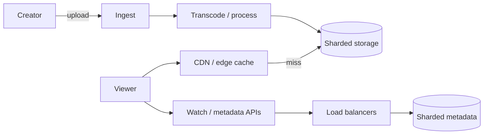

## Problem & Requirements

YouTube must accept uploads from anyone, process them into many resolutions, store an enormous library, and stream popular and long-tail videos with low startup time. Unlike a curated catalog, traffic is extremely skewed: a tiny fraction of videos absorb most views, while the long tail still has to play. Beginners should focus on three requirements: reliable ingest, scalable processing/storage, and a global delivery fabric that keeps origins from seeing every byte request.

Shared video patterns appear in [Netflix streaming](/case-studies/netflix-video-streaming); edge caching philosophy also overlaps [Cloudflare](/case-studies/cloudflare-edge).

## High-Level Design

Uploads land in ingest services, then fan out through processing pipelines into sharded storage. Playback clients resolve a nearby edge cache (CDN). Popular segments are served from cache; misses pull from regional backends. Load balancers sit in front of API and serving fleets. Sharding keeps the metadata and blob layers from becoming a single hotspot.

Patterns: [caching](/patterns/caching), [CDN](/patterns/cdn), [load balancing](/patterns/load-balancing), [sharding](/patterns/sharding).

## Key Components

- **Ingest & processing** — accept uploads, virus/abuse checks, and multi-rendition transcodes.
- **Sharded blob / metadata stores** — partition by video or user keyspace for capacity.
- **Edge / CDN tier** — absorb watch traffic close to viewers.
- **Watch & recommendation APIs** — control plane behind load balancers and caches.
- **Telemetry** — QoE signals that drive bitrate and capacity decisions.

## Deep Dives

### Caching

Thumbnails, manifests, and hot segments are textbook cache wins. A viral video can be mostly edge-served within minutes if TTLs and fill paths are tuned. Cold long-tail content still benefits from regional caches once a pocket of viewers appears. Pattern primer: [caching](/patterns/caching).

### CDN

YouTube’s delivery network (and Google’s broader edge) places capacity near users so backbone and origin load stay manageable. Cache miss storms after a premiere look a lot like Netflix primetime—pre-warm and hierarchical fill help. See [CDN](/patterns/cdn) and compare [Netflix Open Connect](/case-studies/netflix-video-streaming).

## Trade-offs

- **Quality ladders vs. storage cost** — more renditions help heterogeneous devices but explode bytes stored.
- **Aggressive edge caching vs. purge complexity** — takedowns and updates must propagate quickly.
- **Fine-grained sharding vs. cross-shard joins** — great write/read scale; harder analytics and consistency.
- **Global consistency vs. local latency** — metadata updates may be eventually consistent at the edge.

## Evolution

YouTube grew from a single-site architecture into a globally distributed ingest, process, and serve stack on Google infrastructure. Over time, investment shifted toward smarter edge placement, richer adaptive streaming, and storage/serving shards that track internet-scale growth rather than vertical scale-ups.

## Sources

- [Google Research / YouTube engineering posts on large-scale video](https://research.google/) (video infrastructure and processing papers and blogs)
- [Google Cloud Blog — media and video delivery](https://cloud.google.com/blog) (CDN, transcoding, and streaming architecture articles)
- [Chromium / media engineering notes on adaptive playback](https://blog.chromium.org/) (client-side streaming constraints that shape serving)
