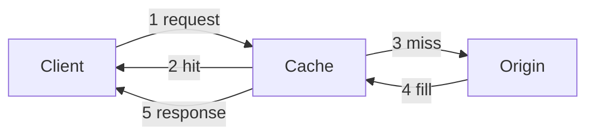

## What it is

Caching keeps a copy of frequently read data in a fast store—memory, a nearby cache tier, or an edge POP—so later requests avoid a slow round trip to the source of truth.

## Why teams use it

Reading from a faraway database or origin for every request wastes latency and capacity. A cache turns repeated work into cheap lookups, which is essential for video catalogs, manifests, and popular API responses.

## When to use it

Use caching when the same data is read much more often than it changes, and when stale-for-a-short-window is acceptable. Pair it with a [CDN](/patterns/cdn) for static or segment content, and with [load balancing](/patterns/load-balancing) so cache fleets stay healthy under load. See how Netflix and YouTube rely on it in their [video streaming](/case-studies/netflix-video-streaming) and [video delivery](/case-studies/youtube-video-delivery) case studies.

