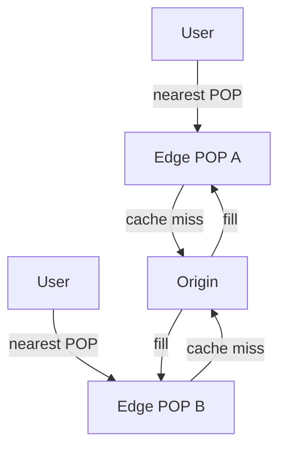

## What it is

A content delivery network (CDN) places caches and reverse proxies in many cities so users fetch bytes from a nearby point of presence instead of a single distant origin.

## Why teams use it

Video segments, images, and other bulky responses benefit from short network paths. A CDN also shields origins from flash crowds by absorbing most traffic at the edge—see [caching](/patterns/caching) for the same idea closer to the app tier.

## When to use it

Choose a CDN when content is cacheable, audiences are geographically spread, or you need DDoS and TLS termination near users. Combine with [load balancing](/patterns/load-balancing) across POPs and origins. Netflix Open Connect, YouTube edge caches, and [Cloudflare’s edge](/case-studies/cloudflare-edge) are classic examples.

