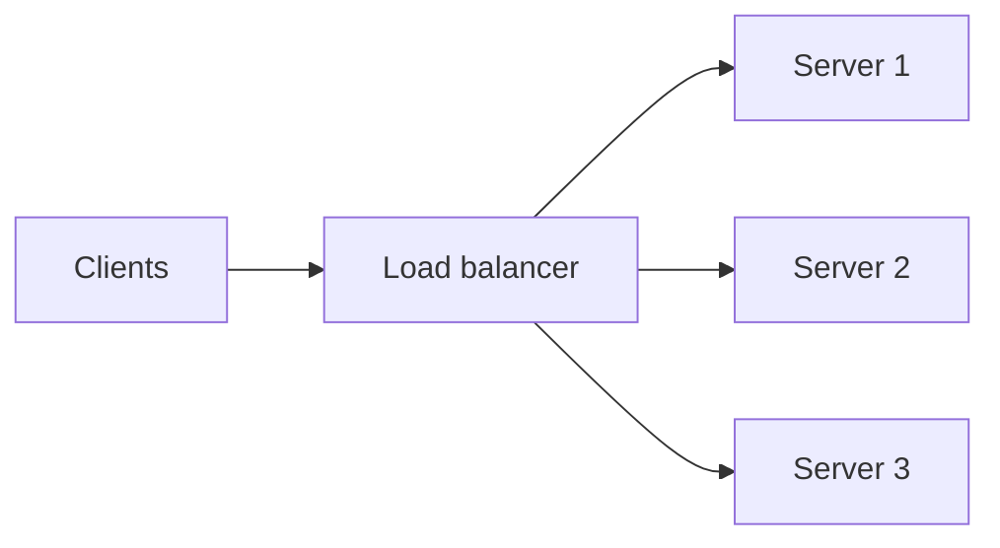

## What it is

Load balancing sits in front of a pool of instances and routes each request (or connection) to a healthy backend so no single machine becomes the bottleneck.

## Why teams use it

Horizontal scale only works if traffic is spread. Balancers also enable rolling deploys, health checks, and failover when a node dies. Without them, popular caches and API fleets melt under uneven load.

## When to use it

Use load balancing whenever you run more than one replica of a service—web tiers, cache clusters, or edge POPs. Often paired with [rate limiting](/patterns/rate-limiting) to shed abuse and with [caching](/patterns/caching) so backends see fewer identical reads. It shows up in every case study here, from [Netflix streaming](/case-studies/netflix-video-streaming) to [Uber matching](/case-studies/uber-ride-matching).

