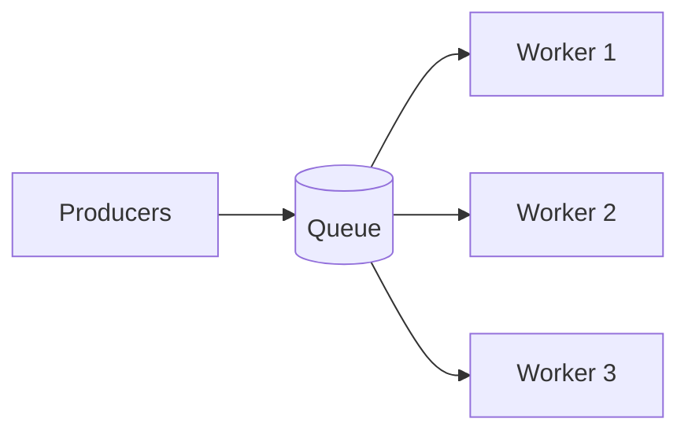

## What it is

A queue stores messages or jobs so producers can hand off work without waiting for consumers to finish. Consumers pull at their own pace, often in parallel workers.

## Why teams use it

Real systems have spikes—trip requests, uploads, encoding jobs. Queues smooth those bursts, decouple teams’ services, and give you retries without losing the request. They complement [rate limiting](/patterns/rate-limiting) (admit carefully) and [sharding](/patterns/sharding) (partition the work).

## When to use it

Use queues for asynchronous workflows, fan-out notifications, and any path where the caller should not block on heavy processing. Uber’s matching and Netflix’s encoding pipelines are good mental models—see [Uber ride matching](/case-studies/uber-ride-matching) and [Netflix streaming](/case-studies/netflix-video-streaming).

