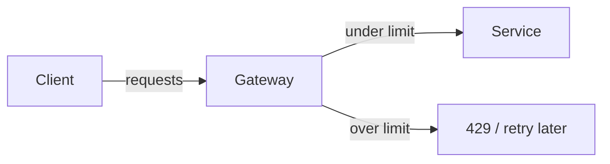

## What it is

Rate limiting tracks how many requests a client (IP, API key, or user) makes in a window and rejects or delays extras once a budget is spent.

## Why teams use it

Unbounded traffic—bugs, scrapers, or attacks—can exhaust CPU, databases, and third-party quotas. Limits protect fairness so one noisy client cannot starve everyone else behind a [load balancer](/patterns/load-balancing).

## When to use it

Apply rate limits on public APIs, login endpoints, and expensive operations. At the edge, Cloudflare-style policies stop abuse early; deeper in the stack, [queues](/patterns/queues) can absorb bursts after admission. See [Cloudflare at the edge](/case-studies/cloudflare-edge) and [Uber ride matching](/case-studies/uber-ride-matching).

