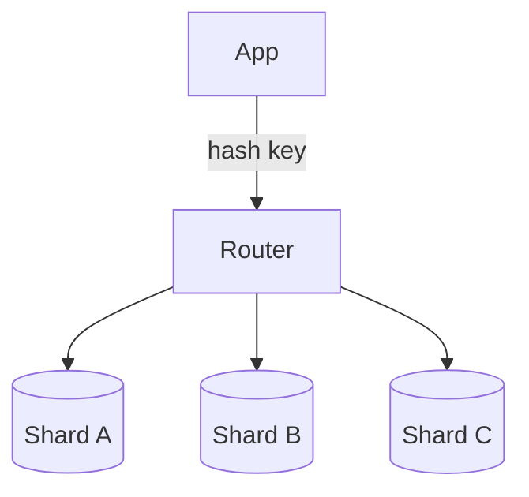

## What it is

Sharding partitions a dataset or workload so each machine owns a slice of the keyspace—by user id, video id, city, or geospatial cell—instead of one giant database holding everything.

## Why teams use it

A single node eventually hits disk, CPU, or connection limits. Shards grow capacity roughly linearly and keep hot partitions isolatable. Teams often place a [cache](/patterns/caching) in front of each shard and feed shard-local workers from [queues](/patterns/queues).

## When to use it

Shard when a single primary cannot meet throughput or storage needs and you can pick a stable partition key. Watch for hot keys and cross-shard queries. YouTube storage/serving and Uber city/geo partitions illustrate the idea—see [YouTube video delivery](/case-studies/youtube-video-delivery) and [Uber ride matching](/case-studies/uber-ride-matching).

