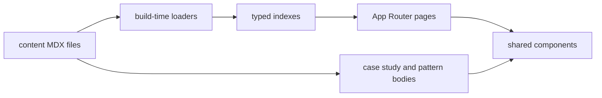

# SDGallery Design Spec

**Date:** 2026-08-01  
**Status:** Approved for implementation planning  
**Product:** SDGallery (System Design Gallery)

## 1. Summary

SDGallery is a free, nonprofit, beginner-friendly website for learning system design through visuals and plain-language explanations of real enterprise architectures and core patterns.

**Primary audience:** Students and beginners learning distributed systems fundamentals.

**v1 approach:** Next.js (App Router) + TypeScript + Tailwind + file-based MDX content in the repo. Build-time indexes power directory, search, and compare. Diagrams use Mermaid via a pluggable `Diagram` component (Excalidraw in v2). Contributions are GitHub PRs only.

## 2. Goals and non-goals

### Goals (v1)

- Ship all seven product surfaces with a thin but real sample corpus.
- Make the primary learning loop clear: discover → pattern or case study → related links → sources.
- Keep content contributor-friendly (MDX + frontmatter, no CMS).
- Keep diagram embedding swappable for Excalidraw later.

### Non-goals (v1)

- User accounts, auth, comments, or in-app editing
- Headless CMS or database
- Server-side search engine / analytics backend
- Excalidraw diagrams (planned v2)
- Donations, payments, or membership

## 3. Information architecture and routes

| Route | Purpose |
|-------|---------|
| `/` | Home: hero, search, featured case studies, pattern pills, recently added |
| `/companies` | Company directory: filters, sort, grid, pagination |
| `/case-studies/[slug]` | Full case study learning page |
| `/patterns` | Pattern index (simple list/grid; also linked from nav and home pills) |
| `/patterns/[slug]` | Pattern / concept hub |
| `/compare` | Side-by-side company comparison |
| `/about` | Mission, sourcing, contribute, contributors |
| `/search` | Cross-type search results |

**Routing decision:** Case studies use `/case-studies/[slug]` (not nested only under companies) so a company can have multiple studies later. Company directory cards link to the company's primary/featured case study.

## 4. Sample corpus (v1)

**Companies:** Netflix, YouTube, Uber, Cloudflare  

**Patterns:** Caching, CDN, Load Balancing, Rate Limiting, Queues, Sharding  

**Featured compare pair:** Netflix vs YouTube (video delivery)

Content depth is introductory and accurate enough for beginners, with sources cited (eng blogs, public talks, reputable writeups). Not a claim of insider architecture.

## 5. Page specifications

### 5.1 Home

- Hero headline: “Learn how the world's best engineering teams build at scale”
- Subheadline + large search bar (placeholder: “Search a company or pattern”)
- Featured Case Studies: 3–4 horizontal cards (logo, company name, one-line hook, scale stat)
- Browse by Pattern: pill tags (Caching, Sharding, Load Balancing, Queues, CDN, Rate Limiting)
- Recently Added: horizontal scroll from `publishedAt`

### 5.2 Company directory (`/companies`)

- Title “Explore Companies” + subtitle
- Left sidebar filters: Industry, Scale, Tech Stack
- Sort: Alphabetical, Most Popular, Recently Updated
- Responsive grid of company cards: logo, name, industry tag, case study count, short description
- Pagination at bottom (client-side over build-time index is acceptable)

### 5.3 Case study (`/case-studies/[slug]`)

Example title shape: “How Netflix Streams to 200M+ Users”

- Header: logo, title, summary, horizontal stat bar (Users, Requests/sec, Data volume, Regions)
- Large Mermaid architecture diagram; when node ids align with section anchors, click scrolls/highlights the section; otherwise decorative
- Left sticky jump nav: Problem & Requirements, High-Level Design, Key Components, Deep Dives, Trade-offs, Evolution, Sources
- Main content with matching headers; Deep Dives as expandable accordions (e.g. Database, Caching, CDN, Queueing)
- Right sidebar: Related Patterns, Related Companies
- Bottom: Sources & Further Reading

### 5.4 Pattern (`/patterns/[slug]`)

Example: “Rate Limiting”

- Header: name, icon, short definition (what / why / when)
- Mermaid diagram of the generic pattern
- “Companies Using This Pattern” cards: logo, name, short implementation snippet, link into relevant case study section
- Sidebar: Related Patterns
- Further reading at bottom

### 5.5 Compare (`/compare`)

Example framing: “Netflix vs YouTube: Video Delivery”

- Top controls: Company A dropdown, Company B dropdown, Compare button
- Two-column synced layout with logo/name headers
- Matching section rows: Problem & Requirements, High-Level Design, Key Components, Trade-offs
- Subtle vertical divider; on mobile, stack columns with mirrored section order
- Disable Compare until both selected; if a company has no case study, show inline guidance

### 5.6 About / Contribute (`/about`)

- Mission hero: “Free, open, community-built system design education”
- How content is sourced (logos: Netflix Tech Blog, Uber Eng, etc.)
- How to Contribute: numbered steps + prominent View on GitHub
- Contributor avatars/grid from static `content/contributors.json`

### 5.7 Search (`/search`)

- Search bar prefilled from `?q=`
- Left filters: Type (Company / Pattern / Case study), Industry
- Result count; mixed result cards (icon, title, category, snippet with highlighted keyword)
- Empty state when no matches

## 6. Content model

```
content/
  companies/{slug}.mdx
  patterns/{slug}.mdx
  case-studies/{slug}.mdx
  contributors.json
```

### Frontmatter (required fields)

**Company:** `name`, `slug`, `logo`, `industry`, `scale`, `techStack[]`, `summary`, `popularity` (integer for sort), `updatedAt`

**Pattern:** `name`, `slug`, `icon`, `definition`, `relatedPatterns[]`, `publishedAt`

**Case study:** `title`, `slug`, `company` (slug), `patterns[]`, `stats` (users, rps, dataVolume, regions), `featured` (boolean), `publishedAt`, `updatedAt`, `relatedCompanies[]`, `hook` (one-line for cards)

**Case study body convention:** Fixed Markdown `##` headings with stable ids for Problem & Requirements, High-Level Design, Key Components, Deep Dives, Trade-offs, Evolution, and Sources. Compare reuses Problem & Requirements, High-Level Design, Key Components, and Trade-offs by heading id. Deep Dive subsections are `###` headings rendered as accordions.

Bodies are MDX. Mermaid is authored as fenced `mermaid` blocks and rendered through the shared `Diagram` component.

### Build-time loaders

- `getCompanies()`, `getPatterns()`, `getCaseStudies()`
- `getSearchIndex()` — flattened entries for client/server filter
- Helpers: featured studies, recently added, companies using pattern X, primary study for company

No database in v1.

## 7. Technical architecture

### Stack

- Next.js App Router, TypeScript, Tailwind CSS
- MDX for content bodies
- Mermaid rendering inside a shared `Diagram` component
- Deploy on Vercel
- Contributions via GitHub PRs

### Shared components

- `SiteHeader`, `SiteFooter`
- `SearchBox`
- `CompanyCard`, `CaseStudyCard`, `PatternPill`, `ResultCard`
- `FilterSidebar`, `SortSelect`, `Pagination`
- `StatBar`, `SectionNav`, `DeepDiveAccordion`
- `Diagram` (Mermaid now; Excalidraw-ready API later)
- `CompareControls`, `CompareColumns`
- `SourcesList`, `ContributeSteps`, `ContributorGrid`

### Data flow



Search and compare run over the build-time index (corpus is small). Popularity sort uses frontmatter `popularity`, not live analytics.

### Diagram versioning

- **v1:** Mermaid string → SVG/render in `Diagram`
- **v2:** Same component accepts Excalidraw scene/embed; routes and content links unchanged

## 8. Visual design

- Calm educational gallery; light surfaces with soft cool-gray/slate atmosphere (subtle gradient or faint grid — not flat single-color only)
- One accent (deep teal or ink-blue) for links/CTAs
- Expressive font pairing (avoid Inter / Roboto / Arial / system-ui as the brand face)
- Cards only where they are the interaction unit (directory, featured, search) — not decorative hero cards
- Diagrams are the visual centerpiece on detail pages (large neutral panel)
- Motion: 2–3 intentional moments (search focus, card hover, accordion / compare entrance)
- Avoid purple-glow AI cliché and dark cyber-dashboard defaults

## 9. Edge cases

- Unknown slug → soft 404 with links to Companies / Patterns
- Invalid / missing Mermaid → friendly placeholder panel, page still renders
- Search no hits → empty state + clear filters
- Compare incomplete selection → button disabled
- Compare company without case study → inline message suggesting another company

## 10. Contribution workflow

- `CONTRIBUTING.md` with MDX templates for company, pattern, and case study
- PR checklist: required frontmatter, Mermaid on case studies and patterns, sources cited
- About page GitHub CTA points at the public repo
- Contributors listed in `content/contributors.json`, updated via PR

## 11. Testing (v1)

- Unit tests for content loaders / index builders and search filtering
- Smoke checks that key routes render with sample content
- No full E2E suite required for first ship

## 12. Success criteria

- All seven surfaces usable with corpus A
- A beginner can navigate Home → Pattern or Case study → related content without confusion
- New entries can be added by PR (MDX/frontmatter/assets) without changing app code for the common case

## 13. Implementation phases (for planning)

1. Scaffold Next.js app, layout, design tokens, header/footer
2. Content schemas, sample MDX corpus, loaders
3. Home + Pattern + Case study pages (core learning loop)
4. Companies directory + Search
5. Compare page
6. About / Contribute + CONTRIBUTING.md
7. Polish empty/error states, smoke tests, deploy
